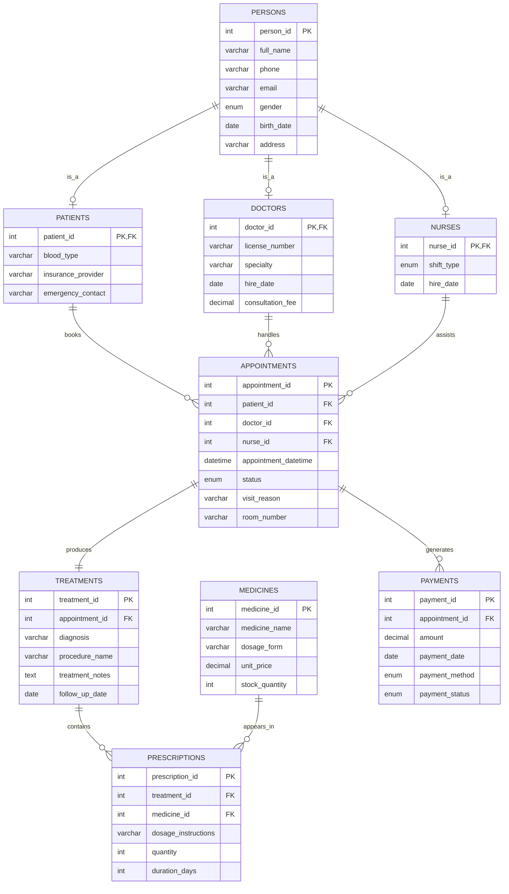

# ER/EER Diagram and Assumptions

## EER Structure

The design uses `persons` as a supertype and the following subtypes:

- `patients`
- `doctors`
- `nurses`

This represents a specialization/generalization feature because every patient, doctor, and nurse is a person, but each subtype stores additional attributes specific to its role.

## Mermaid ER Diagram

## Assumptions

1. A person may belong to only one subtype in this project data set.
2. Each appointment belongs to one patient and one doctor, while nurse assignment is optional.
3. Each appointment has at most one treatment record.
4. A treatment may include multiple prescribed medicines.
5. An appointment may have one or more payment records, although the sample data uses one payment per appointment.
6. The stock of a medicine decreases automatically when a prescription is inserted.
